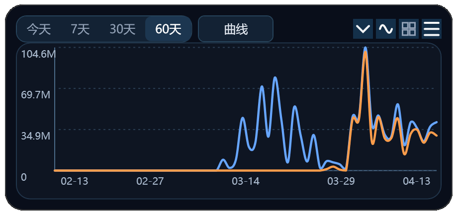

<div align="center">

# Zhipu Usage Widget

**智谱 AI 用量监控桌面悬浮组件**

实时追踪你的智谱 API 用量 — 曲线图、配额提醒、多模型对比，一目了然。

[](https://dotnet.microsoft.com/)
[](https://learn.microsoft.com/dotnet/desktop/wpf/)
[](https://www.microsoft.com/windows)
[](LICENSE)



</div>

---

## ✨ 特性

| 功能 | 描述 |
|------|------|
| 📊 **曲线图模式** | 按 1 天 / 7 天 / 30 天 / 60 天查看 Token 消耗趋势，支持多模型叠加对比 |
| 📋 **概览模式** | 卡片式展示配额用量、模型消耗 Top N，一眼掌握全局 |
| 🔄 **自动刷新** | 可配置定时刷新间隔，后台保持登录态并拉取最新数据 |
| 🔐 **安全存储** | 账号密码通过 Windows DPAPI 加密，仅限当前用户解密 |
| 📌 **桌面悬浮** | 窗口常驻桌面右上角，支持拖拽移动，可折叠/展开 |
| 🎨 **暗色主题** | 毛玻璃质感深色 UI，自定义圆角控件，赏心悦目 |
| 📈 **历史缓存** | 自动缓存每日用量数据到本地，支持 60 天历史回溯 |

---

## 📸 截图

### 桌面悬浮效果

组件以悬浮窗形式常驻桌面右上角，实时展示用量趋势：


### 概览模式

切换到概览视图，以卡片形式展示各模型用量和配额百分比。

### 设置面板

通过菜单栏 ⚙ 按钮打开设置，配置智谱账号、刷新间隔、自动登录等选项。

---

## 🚀 快速开始

### 环境要求

- **Windows 10** (1809+) 或 **Windows 11**
- **Microsoft Edge WebView2 Runtime** ([下载](https://developer.microsoft.com/en-us/microsoft-edge/webview2/)) — Windows 11 通常已内置

### 直接下载（推荐）

前往 [Releases](https://github.com/mr-wuliu/ZKanban/releases) 页面下载最新版 `ZhipuUsageWidget.exe`，双击即可运行，无需安装 .NET。

### 从源码运行

需额外安装 [.NET 10.0 SDK](https://dotnet.microsoft.com/download/dotnet/10.0)。

```powershell
# 克隆仓库
git clone https://github.com/mr-wuliu/ZKanban.git
cd ZKanban

# 启动应用（自动检测源码变更并构建）
.\manage.ps1 start
```

或手动运行：

```powershell
cd ZhipuUsageWidget
dotnet restore
dotnet run
```

首次启动后，点击右上角 ☰ 菜单 → **账号与登录**，填写你的智谱平台账号和密码即可开始使用。

### 管理脚本

```powershell
.\manage.ps1 start     # 启动（源码有变更时自动重编译）
.\manage.ps1 stop      # 停止
.\manage.ps1 restart   # 重启
.\manage.ps1 status    # 查看运行状态
```

---

## ⚙️ 配置说明

所有配置通过 GUI 设置面板管理，存储在 `%AppData%\ZhipuUsageWidget\settings.json`。

| 配置项 | 说明 | 默认值 |
|--------|------|--------|
| 账号 / 密码 | 智谱平台登录凭据 | 空 |
| 刷新间隔 | 自动拉取数据的间隔（分钟） | 10 |
| 自动登录 | 是否自动填入凭据并登录 | ✅ 开启 |
| 时间范围 | 默认展示的曲线范围 | 7 天 |
| 展示模型 | 选择关注的具体模型曲线 | 总用量 + 主力模型 |

### 数据存储位置

| 数据 | 路径 |
|------|------|
| 设置文件 | `%AppData%\ZhipuUsageWidget\settings.json` |
| 历史缓存 | `%AppData%\ZhipuUsageWidget\history\*.json` |
| 运行日志 | `%AppData%\ZhipuUsageWidget\widget.log` |
| WebView2 数据 | `%LocalAppData%\ZhipuUsageWidget\WebView2\` |

---

## 🏗️ 项目结构

```
ZKanban/
├── ZKanban.slnx                           # 解决方案文件
├── manage.ps1                             # 管理脚本（启动/停止/重启）
│
├── .github/workflows/release.yml          # CI：Release 自动打包 exe
│
├── ZhipuUsageWidget/                      # 主项目
│   ├── App.xaml                           # 应用入口 + 全局样式
│   ├── MainWindow.xaml / .cs              # 主窗口（悬浮窗）
│   ├── SettingsWindow.xaml / .cs          # 设置面板
│   ├── app.ico                           # 应用图标
│   │
│   ├── Models/                            # 数据模型
│   │   ├── ChartLayoutHelper.cs           # 图表布局计算引擎
│   │   ├── UsageSnapshot.cs               # 用量快照数据
│   │   ├── UsageQuotaMetric.cs            # 配额指标
│   │   ├── ModelUsageSeries.cs            # 模型用量曲线
│   │   ├── MetricTileViewModel.cs         # 概览卡片 VM
│   │   └── ...                            # 其他辅助模型
│   │
│   └── Services/                          # 核心服务
│       ├── BigModelAutomationService.cs   # WebView2 自动化（登录 + 数据抓取）
│       ├── LocalSettingsService.cs        # 设置持久化 + DPAPI 加密
│       ├── UsageHistoryService.cs         # 历史数据缓存管理
│       └── WidgetTrace.cs                 # 轻量日志
│
└── ZhipuUsageWidget.Tests/               # 单元测试
    └── ChartLayoutTests.cs               # 图表布局计算测试
```

---

## 🔧 技术栈

| 层级 | 技术 |
|------|------|
| 框架 | WPF on .NET 10 |
| 浏览器内核 | Microsoft Edge WebView2 |
| 数据来源 | bigmodel.cn 官方 API（通过 WebView2 代理请求） |
| 凭据保护 | Windows DPAPI（CurrentUser 作用域） |
| 数据序列化 | System.Text.Json |
| 测试 | xUnit |
| UI 风格 | 自定义暗色毛玻璃主题（无第三方 UI 库） |

---

## 🔒 安全性

- **凭据加密**：密码使用 Windows DPAPI (`DataProtectionScope.CurrentUser`) 加密存储，只有当前 Windows 用户可以解密
- **本地运行**：所有数据完全在本地处理，不经过任何第三方服务器
- **无远程上报**：不收集、不上传任何用户数据
- **Git 安全**：`.gitignore` 已排除所有敏感文件（`settings.json`、日志、截图等）

---

## 🧪 开发

```powershell
# 运行测试
cd ZhipuUsageWidget.Tests
dotnet test

# 发布 Release 版本（self-contained 单文件 exe）
cd ZhipuUsageWidget
dotnet publish -c Release -r win-x64 --self-contained true -p:PublishSingleFile=true
```

发布输出位于 `ZhipuUsageWidget\bin\Release\net10.0-windows\win-x64\publish\`。
推送到 GitHub 后通过 Release 自动打包，详见 `.github/workflows/release.yml`。

---

## ⚠️ 注意事项

- 数据抓取基于智谱官网 API 端点（`/api/monitor/usage/*`），如果官网接口变更，可能需要更新 `BigModelAutomationService.cs`
- 自动登录功能通过 WebView2 模拟表单填入实现，如果官网登录页面结构变更，可能需要调整
- 需要 WebView2 Runtime，Windows 11 已内置，Windows 10 可能需要单独安装

---

## 📄 许可证

[MIT License](LICENSE)
